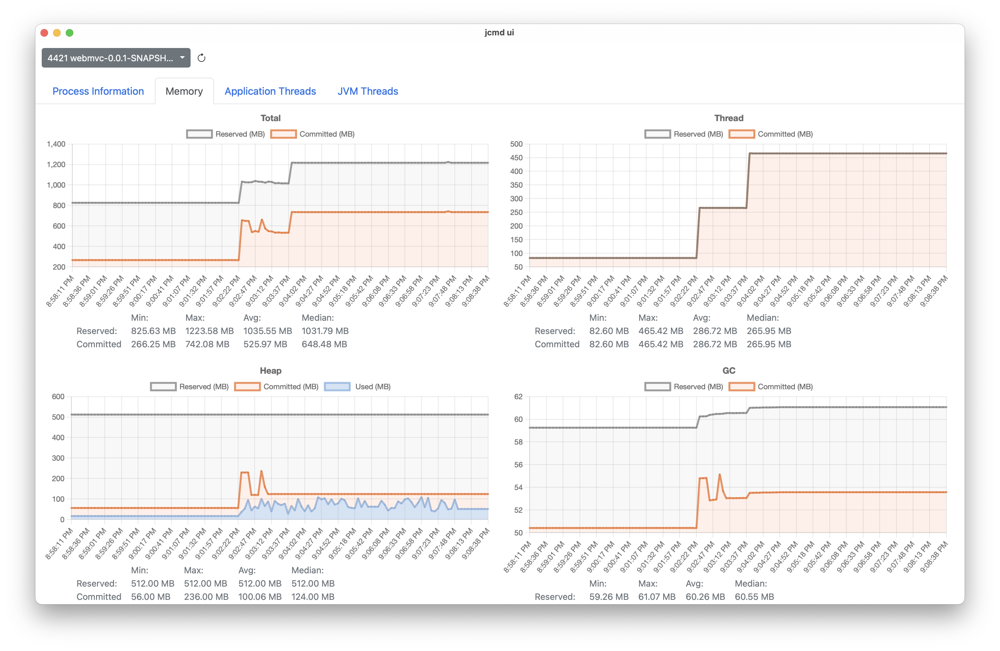
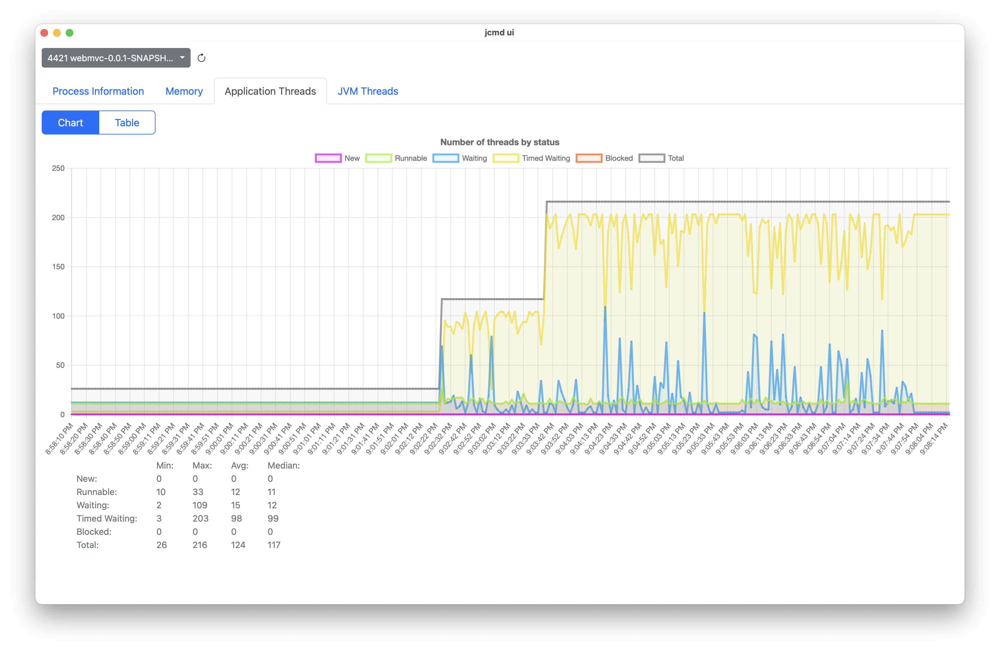

# jcmd-ui

`jcmd-ui` visualizes diagnostic data of jvm applications by using native-memory-tracking capabilities of JDK's 
[`jcmd`](https://docs.oracle.com/en/java/javase/21/docs/specs/man/jcmd.html) cli utility.
It uses [Tauri](https://tauri.app/) as a multi-platform toolkit having a backend written in rust and a frontend
written in typescript.

<p>
    
    
</p>

## JDK Compatibility

`jcmd-ui` should work with all openJDK based distributions, but it is only tested on a limited set.

| Distribution      | Version | Status             |
|-------------------|---------|--------------------|
| GraalVM CE        | 21      | :white_check_mark: |
| GraalVM CE        | 17      | :white_check_mark: |
| Java.net          | 21      | :white_check_mark: |
| Java.net          | 17      | :white_check_mark: |
| Temurin (Eclipse) | 21      | :white_check_mark: |
| Temurin (Eclipse) | 17      | :white_check_mark: |


## Install

There are currently no prebuilt binaries for the different operating systems, but it can build on
macOS and Linux easily.


## Building

`jcmd-ui` can easily be built on a local machine. 
Required tools are:
- [Rust](https://www.rust-lang.org/tools/install)
- [Node.js 20.9.0 (LTS)](https://github.com/nvm-sh/nvm)
- Tauri prerequisites (see below).

### Installing Tauri Prerequisites

Tauri prerequisites can be installed as described in the tauri documentation linked below.

#### macOS

Follow [these](https://tauri.app/v1/guides/getting-started/prerequisites#setting-up-macos) instructions to install
required dependencies for macOS.

#### Linux

Follow [these](https://tauri.app/v1/guides/getting-started/prerequisites#setting-up-linux) instructions to install
required dependencies for the linux distribution of choice.

#### Windows
Windows is currently not supported.

### Cloning the repository
```bash
git clone https://github.com/cschaible/jcmd-ui.git
```

### Downloading build-dependencies
```bash
npm install
```

### Build
```bash
npm run tauri build
```

## Run

`jcmd-ui` requires that the `JAVA_HOME` variable is set or being specified in config file.

> :warning: **On macOS it is not sufficient to publish the JAVA_HOME variable in ~/.bashrc or ~/.zshrc** as GUI 
> applications do not read variables from those files.  
> **The variable can be exported by using launchctl:**  
> launchctl setenv JAVA_HOME "&lt;jdk-path&gt;"  
> This has to be re-applied after each restart of the system.
 
> :information_source: The path to the java home directory can also be provided in the file ~/.config/jcmd-ui/config as follows:  
> java.home=&lt;jdk-path&gt;

After installing the previously built package the ui can be started 
(e.g. graphically via launchpad / gnome menu / etc.).

## Monitor JVM applications

`jcmd-ui` requires to enable **native-memory-tracking** in **summary** mode 
as command line parameter of the jvm application to analyze. The feature can be applied by adding the  
`-XX:NativeMemoryTracking=summary` parameter.

```bash
java -XX:NativeMemoryTracking=summary -jar app.jar
```

Once the jvm application to monitor is started, the dropdown with the list of jvm applications in the upper left 
corner of `jcmd-ui` can be refreshed by clicking on the reload button beside the dropdown.
After selecting the application to monitor data is requested. It may take a few seconds until the data is visualized.
The UI automatically refreshes the charts every few seconds.

> :information_source: jcmd-ui has only a primitive in-memory data storage and data visualization. Therefore, memory 
> consumption will grow noticeable over time. It is not recommended to track metrics longer than 30 minutes.
> Restarting the measurement by reloading and (re-selecting) an application from the application list releases 
> the memory.

## Developing

Before applying changes to the code, the [Building](#Building) instructions should be applied successfully to ensure 
that potential errors are not related to general build issues.

### Starting dev-server

Tauri supports hot-reloading by using the `dev` server to see changes immediately applied in the running application.
The rust code and frontend-code is automatically re-compiled (depending on what has been changed):

```bash
npm run tauri dev
```

### Developer Tools

Tauri applications are rendered in a web-view. To debug problems in the frontend part or to analyze problems in the 
communication between the frontend and the backend, the browser's (i.e. web-view's)
[developer tools](https://tauri.app/v1/guides/debugging/application/#webview-console) can be used to analyze the issues.

### Analyzing crashes

`jcmd-ui` is tested on a limited set of operating systems (using english as system language) and a limited set JDKs. 
Therefore, errors can occur. If the application crashes, the root cause normally can be identified by looking in 
the terminal where the dev-server has been started.
Often it makes sense to run the executed `jcmd` commands manually in the terminal to preview what's returned to
be parsed.